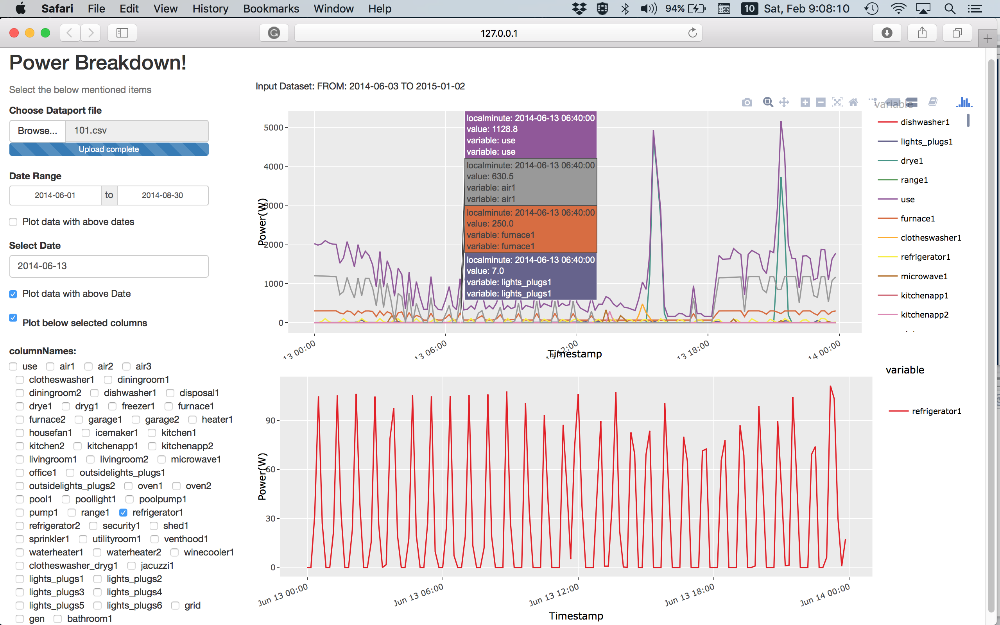

# Ground Truth Marking for Rimor 

##PowerViz
The PowerViz application displays power aggregate and appliance wise consumption of a selected home. A screen shot of running PowerViz is shown as 

PowerViz has following features:

1. Allows plotting of a single day or a range of days (options provided on left panel of the PowerViz)
2. Allows plotting of a single target appliance from all appliances of a home as shown in the bottom plot of above figure. Selecting a single target appliance from N appliances of a home shows power consumption signature clearly
3. This allows Zoom in and out opitions hence allowing to analyze the changing power consumption behaviour at any time of the selected day
4. Further, this provides comparitive power consnumptions of all appliances at selected timings as shows in the top plot of the above figure.